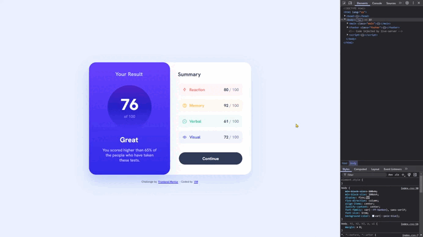

# Frontend Mentor - Results summary component solution

This is a solution to the [Results summary component challenge on Frontend Mentor](https://www.frontendmentor.io/challenges/results-summary-component-CE_K6s0maV). Frontend Mentor challenges help you improve your coding skills by building realistic projects. 



## Table of contents

🔳 [The challenge](#the-challenge-mucle)

🔳 [Screenshots](#screenshots-camera)

🔳 [Links](#links-link)

🔳 [Built with](#built-with-hammer_and_pick)

🔳 [What I learned](#what-i-learned-nerd_face)

🔳 [Author](#author-beginner)


## The challenge :mucle:

Users should be able to:

🎯 View the optimal layout for the interface depending on their device's screen size

🎯 See hover and focus states for all interactive elements on the page

🎯 **Bonus**: Use the local JSON data to dynamically populate the content

## Screenshots :camera:


## Links :link:

[Live Demo](https://mendezpvi.github.io/fem-results-summary-component/) 👈

[Solution on Frontend Mentor](https://www.frontendmentor.io/solutions/results-summary-component-MuAbYHarLa) 👈

[Frontend Mentor Project Showcase](https://github.com/mendezpvi/frontend-mentor-showcase) 👈

## Built with :hammer_and_pick:

📌 Semantic HTML5 markup

📌 CSS custom properties

📌 Flexbox

📌 CSS Grid

📌 Mobile-first workflow


## What I learned :nerd_face:

+ Asynchronously fetches data from a given URL and returns the parsed JSON response.
+ If the request fails, an error message is logged to the console.

```js
/**
 * @param {string} url - The URL from which to fetch data.
 * @returns {Promise<Object|undefined>} - A promise that resolves to the parsed JSON data,
 * or `undefined` if an error occurs.
 */
async function fetchData(url) {
  try {
    // Fetch data from the specified URL
    const res = await fetch(url);

    // Check if the response status is not OK (e.g., 404, 500)
    if (!res.ok) throw new Error(`HTTP error! Status: ${res.status}`);

    // Parse and return the JSON response
    return await res.json();
  } catch (err) {
    // Log an error message if fetching fails
    console.error("Error fetching data: ", err);
  }
}
```

+ Calculates the average score from an array of objects containing scores.
+ The result is rounded to the nearest whole number.

```js
/**
 * @param {Array<Object>} data - An array of objects, each containing a `score` property.
 * @returns {number} - The rounded average score.
 */
function calculateAverageScore(data) {
  // Sum all scores using the reduce method
  const totalAverage = data.reduce((acc, curr) => acc + curr.score, 0);

  // Calculate the average and round to the nearest integer
  return Math.round(totalAverage / data.length);
}
```

## Author :beginner:

✨ Frontend Mentor - [@mendezpvi](https://www.frontendmentor.io/profile/mendezpvi)

✨ X-Twitter - [@mendezpvi](https://x.com/mendezpvi)
